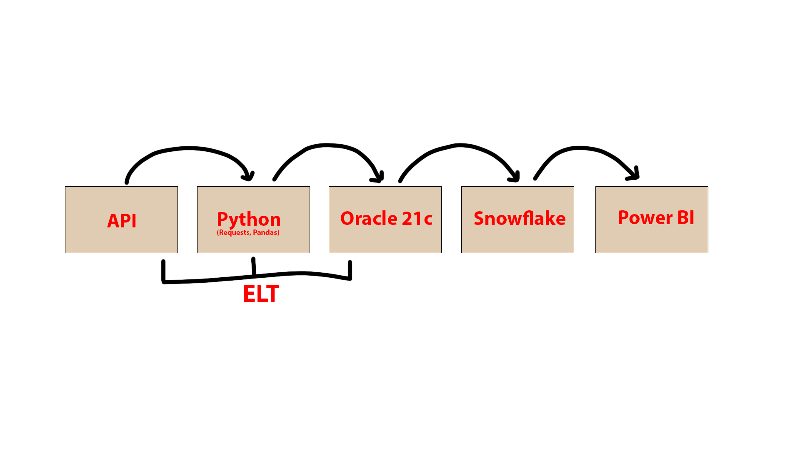
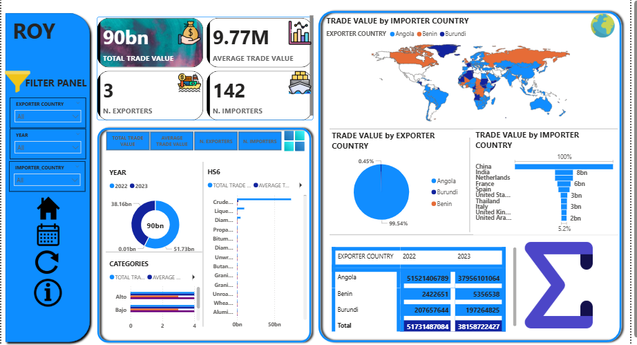

# Creación de Dashboard en Power BI a partir de una API

Este proyecto consiste en la construcción de un dashboard en Power BI a partir
de datos obtenidos desde una API externa.

Los datos son extraídos mediante la librería **Requests** en Python, consumiendo
la API y transformando la respuesta en estructuras tabulares. Posteriormente, se
utiliza **Pandas** para limpiar, estructurar y organizar la información en un
**modelo estrella**, compuesto por tablas de dimensiones y una tabla de hechos.

Una vez generado el modelo de datos, las tablas son cargadas en una base de datos
**Oracle 21c** utilizando la librería **oracledb** de Python. Sobre Oracle, se
realizan procesos adicionales de transformación y validación de datos mediante
**SQL Developer**, asegurando la integridad y consistencia de la información.

Posteriormente, los datos transformados son transferidos a un **Data Warehouse
en Snowflake** utilizando la librería
**snowflake.connector.pandas_tools** desde Python.

Finalmente, una vez los datos se encuentran en Snowflake, se establece la
conexión desde **Power BI**, donde se construye el dashboard para el análisis
visual de la información.

## Arquitectura del proyecto

El flujo de datos del proyecto sigue el siguiente proceso:

## Objetivo del Dashboard

El objetivo del dashboard es analizar el comercio internacional entre países,
permitiendo identificar los principales exportadores e importadores,
analizar la evolución del valor comercial por año y evaluar la concentración
del comercio por tipo de producto (HS6).

El dashboard facilita la toma de decisiones mediante indicadores clave (KPIs),
visualizaciones geográficas y análisis comparativos.

## Preguntas que responde el dashboard

- ¿Cuál es el valor total y promedio del comercio internacional analizado?
- ¿Qué países lideran las exportaciones y las importaciones?
- ¿Cómo se distribuye el comercio por país a nivel geográfico?
- ¿Cómo varía el comercio entre diferentes años?
- ¿Qué productos (HS6) generan mayor valor comercial?
- ¿Qué tan concentrado está el comercio en ciertos países?

## Alcance del proyecto

El proyecto abarca la extracción, transformación y visualización de datos de
comercio internacional a partir de una API pública.

Incluye:
- Consumo de datos desde API externa
- Transformación y modelado en esquema estrella
- Carga en Oracle 21c y Snowflake
- Visualización interactiva en Power BI

No incluye:
- Automatización mediante orquestadores
- Actualización en tiempo real

## Proceso ETL / ELT

1. **Extracción**
   - Se consumen datos desde la API mediante la librería `requests`.
   - La respuesta se recibe en formato JSON.

2. **Transformación**
   - Los datos son convertidos a DataFrames con `pandas`.
   - Se limpian valores nulos y se normalizan columnas.
   - Se construye un modelo estrella (dimensiones y hechos).

3. **Carga en Oracle 21c**
   - Las tablas son cargadas usando `oracledb`.
   - Se realizan validaciones y ajustes mediante SQL Developer.

4. **Carga en Snowflake**
   - Los datos finales se transfieren al Data Warehouse
     utilizando `snowflake.connector.pandas_tools`.

5. **Visualización**
   - Power BI se conecta directamente a Snowflake para la
     creación de visualizaciones y dashboards.

## Modelo de Datos

El modelo de datos fue diseñado bajo un esquema de **modelo estrella** para
optimizar el rendimiento analítico.

### Tabla de hechos
- Fact_Trade
  - Trade_Value
  - Quantity
  - Unit_Value

### Tablas de dimensiones
- Dim_Exporter
- Dim_Importer
- Dim_Product (HS6)
- Dim_Year
- Dim_Unit

## Indicadores Clave (KPIs)

- Valor total del comercio
- Valor promedio de las transacciones
- Número de países exportadores
- Número de países importadores
- Valor comercial por país y año

## Dashboard en Power BI

El dashboard permite analizar interactivamente el comercio internacional
mediante filtros por país exportador, importador y año.

Características:
- KPIs principales
- Visualización geográfica
- Comparaciones por país
- Análisis temporal

La representación del dashboard es el siguiente:

## Tecnologías utilizadas

- Python (requests, pandas)
- Oracle Database 21c
- SQL Developer
- Snowflake
- Power BI

## Conclusiones

El análisis del comercio internacional muestra un valor total de comercio
aproximado de **90 billones**, con un valor promedio por transacción de
**9.77 millones**, lo que indica una alta concentración de valor en un número
limitado de operaciones.

El comercio analizado está liderado por un número reducido de países
exportadores, principalmente **Angola, Benín y Burundi**, siendo **Angola** el
mayor exportador entre ellos. Aunque los países importadores se encuentran más
ampliamente distribuidos, los resultados evidencian una fuerte dependencia de
pocos países productores, considerando además que los datos de la API se
encuentran limitados.

A nivel geográfico, el valor del comercio se concentra en regiones específicas,
destacando mercados clave como **China e India**, que presentan los mayores
volúmenes de importación.

El análisis temporal evidencia variaciones relevantes entre los años
**2022 y 2023**, reflejando cambios en los flujos comerciales y en la demanda
internacional. De los países exportadores analizados, **Benín** fue el único que
registró un incremento en su valor comercial, superando el **100%** con respecto
al periodo anterior.

Por categoría de producto (HS6), se identifican productos que concentran la mayor
parte del valor comercial. En particular, el **petróleo crudo** representa el
producto con mayor contribución al valor total del comercio, lo que permite
identificarlo como un segmento estratégico dentro del análisis.

En general, el comercio analizado presenta un **alto nivel de concentración**,
tanto por país exportador como por categoría de producto, lo que resalta la
importancia de la **diversificación comercial** y la **gestión de riesgos** en el
contexto del comercio internacional.

## Mejoras futuras

- Automatización del pipeline
- Incremental load
- Control de calidad de datos
- Seguridad a nivel de fila en Power BI

